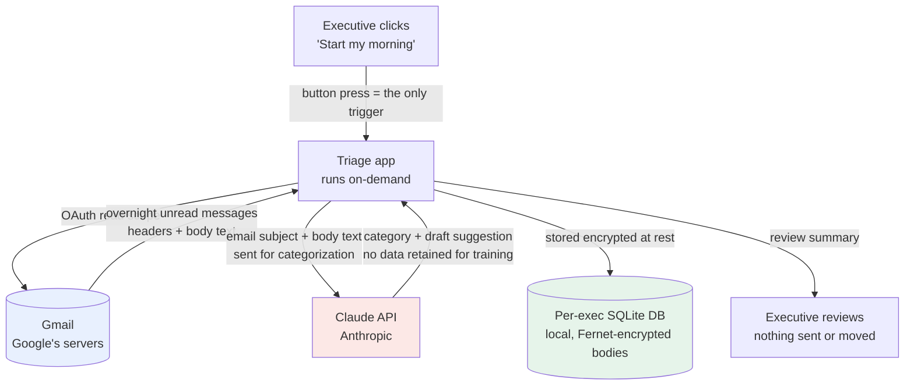

# Data Flow — Email Triage

_Client-facing artifact. Walk through this in the consent conversation (`CONSENT_SCRIPT.md`)._

This is the complete path the executive's email data takes. There are exactly three places
data lives or is processed, and the exec controls the trigger for all of it.

## The three data locations
| # | Location | Operator | What's there | Control |
|---|---|---|---|---|
| 1 | **Gmail** | Google (the exec's own account) | The source mail | Exec's Google account; revoke our access anytime in Google security settings |
| 2 | **Claude API** | Anthropic | Email text **in transit** for categorization only | Anthropic API terms; not used to train models; we send the minimum needed |
| 3 | **Per-exec SQLite DB** | This tool, on the machine you run it on | Categorized history; **email bodies encrypted at rest** | One DB per exec, no commingling; deletable on request (see `DATA_HANDLING.md`) |

## Trust boundary
- **No always-on service.** The app runs only when the exec triggers it; there is no background job
  reading mail.
- **Read/modify scope only** — and at the starting (Assisted) rung the tool **proposes**; it does not
  send, delete, or move anything without the exec's review.
- **The trigger is the consent.** "Nothing touches your inbox unless you press the button."

## What we deliberately do NOT do
- We do not store attachments' contents in this MVP.
- We do not forward email anywhere except the Claude API call above.
- We do not delete mail — the archive model is *keep everything, sort nothing by hand*.
