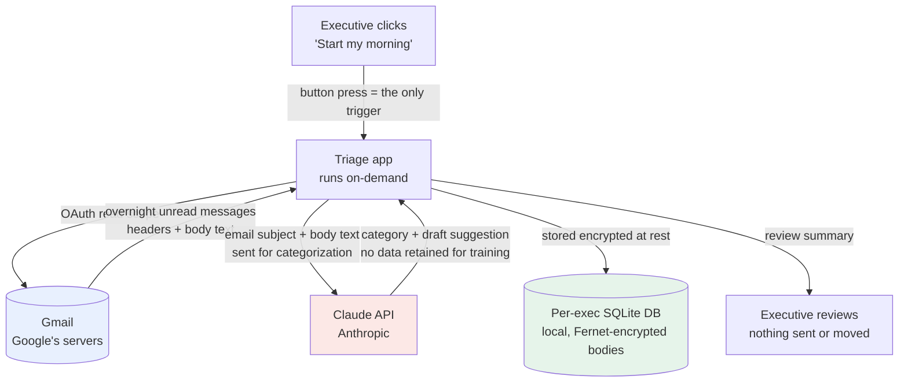

# Data Flow — Email Triage

_Client-facing artifact. Walk through this in the consent conversation (`CONSENT_SCRIPT.md`)._

This is the complete path the executive's email data takes. There are exactly three places
data lives or is processed, and the exec controls the trigger for all of it.

## The three data locations
| # | Location | Operator | What's there | Control |
|---|---|---|---|---|
| 1 | **Gmail** | Google (the exec's own account) | The source mail | Exec's Google account; revoke our access anytime in Google security settings |
| 2 | **Claude API** | Anthropic | Email text **in transit** for categorization only | Anthropic API terms; not used to train models; we send the minimum needed |
| 3 | **Per-exec SQLite DB** | This tool, on the machine you run it on | Categorized history; **email bodies encrypted at rest** | One DB per exec, no commingling; deletable on request (see `DATA_HANDLING.md`) |

## What happens when your email is sorted (plain English)
The categorization step (location 2 above) is the only point your mail touches a third party,
so here is exactly how it works:

- **It's a round trip, not an upload.** For each email, the app sends the text + sorting
  instructions to Anthropic's Claude API over an encrypted connection, gets back a category and a
  draft, and the connection closes. Each email is a separate, self-contained request — there is no
  standing session and no ongoing access to the inbox.
- **Not used to train AI.** Under Anthropic's commercial API terms, inputs and outputs are not used
  to train their models.
- **Kept only briefly.** Anthropic retains API data for a limited window (~30 days) for abuse
  monitoring, then deletes it. **Zero Data Retention** can be arranged for sensitive clients so
  nothing is retained at all.
- **Whose account / who pays.** The API key belongs to an Anthropic account. In the default
  deployment that is **True North AI's** account, so True North AI pays the (small) usage cost. A
  client may instead use their own Anthropic account/key if they prefer to own the data
  relationship directly.
- **What it costs.** At the default model (Haiku 4.5), triage runs roughly **$0.0015–0.002 per
  email** — on the order of a couple of dollars per executive per month. Estimates; actuals show in
  the Anthropic Console usage dashboard.

> Confirm Anthropic's current terms at deploy time — policies can change (see knowledge-cutoff note).

## Trust boundary
- **No always-on service.** The app runs only when the exec triggers it; there is no background job
  reading mail.
- **Read/modify scope only** — and at the starting (Assisted) rung the tool **proposes**; it does not
  send, delete, or move anything without the exec's review.
- **The trigger is the consent.** "Nothing touches your inbox unless you press the button."

## What we deliberately do NOT do
- We do not store attachments' contents in this MVP.
- We do not forward email anywhere except the Claude API call above.
- We do not delete mail — the archive model is *keep everything, sort nothing by hand*.
